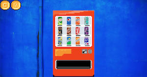

# Interactive Music Mixer

Built and designed multimedia application using design and motion tools, CSS, HTML, Java Script.
HTML Page containing drag and drop functunality to load audio and create dynamic audio experience.

## Getting Started

### Dependencies

Uses CSS3, HTML5 & Java Script. Audios from Logic X.

### Installing

Cd to the directory of your choice, clone, and load index.html in any browser!

### How to use

Drag and drop the musical soda cans to play music.
One reset button and introduction button included.
Have fun!

## Authors

* **Daffodil** - *Designer* *Developer* 
* **Soyoon Lee** - *Developer* *Designer*

## Acknowledgments

*  Design Inspiration - Pinterest
*  Reference - incredibox.com
*  Trevor's lessons

